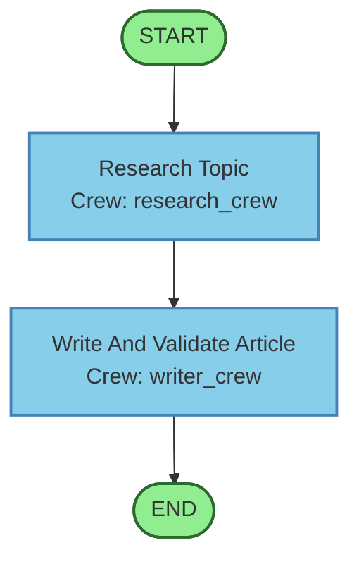

# Flow Visualizer Module

Generate visual flowchart diagrams from your YAML configuration using Mermaid syntax.

## Features

### 🎨 Main Flow Diagram
- Shows the complete execution flow with steps
- Displays crew assignments for each step
- Highlights START and END nodes
- Shows routing between steps

### 📋 Crew Detail Diagrams
- Shows agents within a crew
- Displays tasks and their assignments
- Shows tool usage per agent
- Illustrates task execution order

### 📊 Flow Summary
- Quick stats about your flow
- Agent and task counts
- Crew listings

## Usage

### Basic Usage

```python
from configurable_agents.core.flow_visualizer import (
    generate_mermaid_diagram,
    generate_crew_diagram,
    get_flow_summary
)
import yaml

# Load your config
with open('flow_config.yaml', 'r') as f:
    config = yaml.safe_load(f)

# Generate main flow diagram
mermaid_code = generate_mermaid_diagram(config)
print(mermaid_code)

# Get summary stats
summary = get_flow_summary(config)
print(f"Flow has {summary['num_steps']} steps and {summary['num_agents']} agents")

# Generate crew-specific diagram
crew_config = config['crews']['research_crew']
crew_diagram = generate_crew_diagram(crew_config, 'research_crew')
print(crew_diagram)
```

### Test the Visualizer

Run the test script:

```bash
python src/configurable_agents/test_visualizer.py
```

This will output:
1. Flow summary statistics
2. Main flow diagram (Mermaid syntax)
3. Individual crew diagrams

### View the Diagrams

**Option 1: Online Viewer**
1. Copy the Mermaid syntax from the output
2. Visit https://mermaid.live/
3. Paste and view the rendered diagram

**Option 2: In Streamlit**
```python
import streamlit as st
from configurable_agents.core.flow_visualizer import generate_mermaid_diagram

# Generate diagram
mermaid_code = generate_mermaid_diagram(config)

# Display in Streamlit
st.markdown(f"```mermaid\n{mermaid_code}\n```")
```

## Example Output

### For Article Generation Flow:

**Flow Summary:**
```
Name: article_generation_flow
Steps: 2
Crews: 2
Agents: 3
Tasks: 3
Crew Names: research_crew, writer_crew
```

**Main Flow Diagram:**


## API Reference

### `generate_mermaid_diagram(config: dict) -> str`

Generate a flowchart showing the complete flow execution path.

**Args:**
- `config`: Complete flow configuration dictionary

**Returns:**
- Mermaid diagram syntax as string

---

### `generate_crew_diagram(crew_config: dict, crew_name: str) -> str`

Generate a detailed diagram for a single crew.

**Args:**
- `crew_config`: Single crew configuration dictionary
- `crew_name`: Name of the crew (for labeling)

**Returns:**
- Mermaid diagram syntax as string

---

### `get_flow_summary(config: dict) -> dict`

Get summary statistics about the flow.

**Returns:**
- Dictionary with keys:
  - `flow_name`: Name of the flow
  - `description`: Flow description
  - `num_steps`: Number of execution steps
  - `num_crews`: Number of crews
  - `num_agents`: Total agents
  - `num_tasks`: Total tasks
  - `crew_names`: List of crew names

## Integration with Streamlit

```python
import streamlit as st
from configurable_agents.core.flow_visualizer import (
    generate_mermaid_diagram,
    get_flow_summary
)

# Get summary
summary = get_flow_summary(config)

# Display stats
col1, col2, col3 = st.columns(3)
col1.metric("Steps", summary['num_steps'])
col2.metric("Agents", summary['num_agents'])
col3.metric("Tasks", summary['num_tasks'])

# Display diagram
mermaid_code = generate_mermaid_diagram(config)
st.markdown(f"```mermaid\n{mermaid_code}\n```")
```

## Next Steps

Once integrated into Streamlit, you'll be able to:
- ✅ See your flow visually before execution
- ✅ Understand agent and task relationships
- ✅ Debug routing and crew assignments
- ✅ Share flow diagrams with team members
